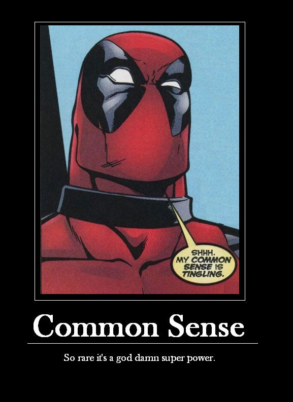

# The Manual

Treefrog's goal is to foster a fun, productive, and enthusiastic environment that employees look forward to being a part of each day. We would like the workplace to be full of inspiration, creativity, and innovation.

In addition, Treefrog's intent is to excel and provide an environment in which to excel. Treefrog would like Frogs to have the most respected and coveted jobs in all industries and maintain high personal and corporate reputations in a stimulating, supportive workplace. In return, Treefrog expects individuals to be highly, personally motivated, to work harder and longer, to have extraordinary intent to achieve and intent to comprehend, to be more self-aware, more self-managing, and more personally accountable than people in any other circumstance at any other job. It is a big ask.

What follows is a collaborative description of how we are going accomplish this Heraclean task.

## Table of Contents

The core sections of the Manual, with detailed explanations, rationale and examples where possible, so your life at Treefrog is clear and unfetterred. (If it isn't clear, feel free to help create clarity!).

* **Basic Frog Expectations**
	* [Attitude](attitude.md) - *"Success at Treefrog is all about Attitude."*
	* [Client Service](clientservice.md) - *"Treat both Clients and Frogs as you would have them treat you."*
	* [Social Ettiquette](social.md) - *"As a digital agency, you are a Frog 24 hours a day. Act like it."*
	* [Punctuality](Punctuality.md) - *"Be there when you say you will be."*
	* [Dress Code](dress.md) - *"Preferably, wear clothes."*
	* [Housekeeping](housekeeping.md) - *"We are not your mother."*
	* [Out of Office](outofoffice.md) - *"If you leave you office, let people know."*
* **Basic Frog Obligations**
	* [Confidentiality](confidentiality.md) - *"You may not talk about clients outside of Treefrog."*
	* [Privacy](privacy.md) - *"Don't be snoopy."*
	* [Ownership](ownership.md) - *"Treefrog owns your brain."*
	* [Injury](injury.md) - *"If you get hurt, say something immediately."*
	* [Third Party Content](thirdpartycontent.md) - *"It is illegal to steal other people's work."*
	* [Trademarks](trademarks.md) - *"Respect the Brand."*
	* [Records](records.md) - *"We keep paper about you."*
* **Hours and Pay**
	* [Hours](hours.md) - *"40 hours a week, rain or shine."*
	* [Timekeeping](timekeeping.md) - *"You MUST track your time. Yes, you."*
	* [Breaks](breaks.md) - *"We don't pay for breaks."*
	* [Public Holidays](holidays.md) - *"We take Statutory Holidays."*
	* [Vacations](vacations.md) - *"Everybody gets 2 weeks holidays to start."*
	* [Compensation and Pay](Compensation.md) - *"We pay weekly."*
	* [Overtime](overtime.md) - *"We do not do overtime."* (Also, [Exempt](Exempted.md) & [Non-Exempt](Exempted.md))
	* [Raises](raises.md) - *"We do not give "cost of living" increases."*
	* [Work from home](workfromhome.md) - *"Don't work from home, but..."*
	* [Probation](probation.md) - *"3 months probation is normal."*
	* [Earnings Interruptions]() - if interruption in earninbgs, a record of employemtn must be filed.
* **Emergency Leave (8 Paid days, 2 Unpaid days)**
	* [Sickdays](sickdays.md) - *"5 sick days a year is appropriate."*
	* [Bereavment](emergencyleave.md) - *"If your family member dies, you should take a break and mourn. (3 days)"*
* **Leaves of Absences (UNPAID, but stay a Frog)**
	* [Pregnancy](Pregnancy.md) - *"."*
	* [Paternity](Paternity.md) - *"."*
	* [Family Medical](FamilyMedical.md) - *"."*
	* [Family Care Giver](FamilyCareGiver.md) - *"."*
	* [Crime related Death and Disappearance](Crimerelated.md) - *"."*
	* [Critically Ill Child](CriticallyIllChild.md) - *"."*
	* [Court or Jury Duty](JuryDuty.md) - *"."*
	* [Voting](Voting.md) - *"."*
	* [Domestic Violence](DomesticViolence.md) - *"."*
* **Expenses**
	* [Expenses](expenses.md) - *"If Treefrog should have paid for it, we will reimburse you."*
	* [Donations](Donations.md) - *"We don't donate to charities on your behalf."*
* **Benefits**
	* [Health Benefits](benefits.md) - *"We want people to be super healthy."*
	* [Short Term Disability](std.md) - *"We want people to be super healthy."*
	* [Long Term Disability](ltd.md) - *"We want people to be super healthy."*
* **Extra Benefits**
	* [Bounties](bounties.md) - *"If you need extra money, we'll give you some options."*
	* Ninja Projects
	* [Green Wearing](greenwearing.md) - *"You become what you wear."*
	* [Commuting](commuting.md) - *"The first step to saving the world is smaller than you think."*
	* Twitter/Social
* **Performance**
	* [Production Performance](productionperformance.md) - *"."*
	* [Distractions](distractions.md) - *"Don't let yourself get distracted."*
	* [Productivityflags](productivityflags.md) - *"."*
	* [Utilization](Utilization.md) - *"."*
	* [Discipline](discipline.md) - *"."*
* **Physical Stuff**
	* [Equipment](equipment.md) - *"."*
	* [Devices](devices.md) - *"Treat your stuff with respect."*
	* [Belongings](belongings.md) - *"Keep your stuff at home and Treefrog's stuff at Treefrog."*
	* [Purchasing](purchasing.md) - *"Purchase the best you can get within reason, and expect it to last longer."*
* **Conflicts of Interest** ([Overview](conflictofinterest.md)) - *"Don't do ethically gray stuff."*
	* [Exclusive Service and Moonlighting](exclusiveservice.md) - *"You have ONE job."*
	* [Inducements](Inducements.md) - *"You can't use Treefrog to get additional stuff."*
	* Fraud
* **Diversity and Equality**
	* [Respect](respect.md) - *"."*
	* [Diversity](diversity.md) - *"."*
	* [Birthdays](birthdays.md) - *"."*
* **Problems at Work**
	* [Security](security.md) - *"."*
	* [Safety](safety.md) - *"."*
	* [Harassment](harassment.md) - *"."*
	* [Absenteeism](absenteeism.md) - *"."*
	* [Drugsandalcohol](drugsandalcohol.md) - *"."*
	* [Mistakes](mistakes.md) - *"."*
* **Leaving Treefrog**
	* [Quitting](Quitting.md) - *"If you leave Treefrog high and dry, you suck."*
	* [Job Abandonment](Abandonment.md) - *"Don't just disappear."*
	* [Recommendations](Recommendations.md) - *"We don't write recommendations."*
	* [Portfolio](portfolio.md) - *"You cannot use Treefrog work in a personal portfolio."*
	* [Alumni](Alumni.md) - *"."*

If you see something missing in this manual, please report it immediately!

### About the Manual

This Manual is not designed to address every circumstance or question that may arise over the course of your employment with Treefrog, and it is not intended to stifle creativity in how you do your work. The guidelines are intended to help you with your work life and ensure that your expectations are clear.

The purpose of this Manual is to:

- Summarize the policies and practices of the company in an open, dynamic format.
- Set the company standard for professional conduct and responsibilities for every Frog.
- Add clarifying examples and explanations where possible.
- Allow for open and transparent dialogue surrounding conduct and responsibility.
- Keep a living history of questions around policies and legalities to maximize growth in the future.
- Allow for fast additions when new issues or concerns arise.

The policies and procedures in this Manual will be added and expanded upon as the company and Frogs continue to grow and mature.

It is not enough to be a good place to work. Treefrog wants to set an example for all other businesses on how the perfect business should be run and how all people, in every job, should act.

### Common Sense

Everything in this manual should be common sense to most - though given historical and cultural conditioning, we may all see the world differently. However, when confused about what the correct answer should be - lean towards common sense!

#### How Often Should I Read the Manual?

If you are new to Treefrog, you are required to familiarize yourself immediately with the content of this Manual because it will answer most questions you may have about the company.

You should monitor the ongoing changes regularly. Major changes will be broadcast immediately through email and summarized during the next Quarterly State of the Union.

Circumstances will undoubtedly arise that may require policies, practices, or benefits described in this Manual to be changed.

#### Do I Have to Agree With Everything?

You are obligated to carefully review, understand, and follow the provisions of this Manual. You are required to agree and to abide by the policies set forth in the Manual and understand that this Manual will govern your conduct as a Frog. You do not need to agree, but you are obligated to abide by the policies herein. If you do not agree with a provision in the Manual, ensure you have communicated your concerns accordingly to the right person, at the right time. This will ensure that you do not slip into [malicious compliance](malicious compliance) - this helps no one.

It is not possible to anticipate every situation that may arise in the workplace or to provide information that answers every possible question. However, we will try. If something is not abundantly clear, we will strive to make it so and ensure we adhere to the resulting clear discussion accordingly.

#### Terms of Reference:

**"Frog"** - Throughout this Manual, the term "Frog" will be used in lieu of "employee".

**"HQ" or "Pond"** - Throughout this Manual, the terms "HQ" or "Pond" will be used in lieu of "567 Davis Drive".

**"Information Technology Professional"** - This means an employee who is primarily engaged in the investigation, analysis, design, development, implementation, operation, or management of information systems based on computer and related technologies through the objective application of specialized knowledge and professional judgment. This is to say, almost everyone at Treefrog.

