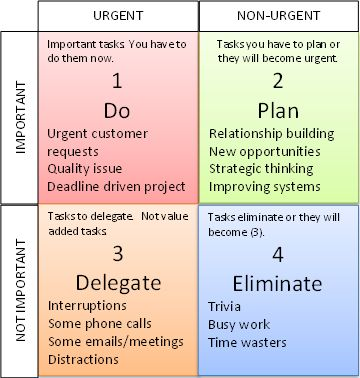

# Important vs. Urgent

> There is time for everything that is important.

<i>Often we get caught up in the crazy, and focus on what is urgent instead of focusing on what is important.</i>

What's the difference between urgent and important tasks, and how can we make sure we always get this right?

This article: https://crew.co/blog/urgent-vs-important/

####The Eisenhower Box

Developed by Dwight Eisenhower, a five-star general in the United States Army, the Supreme Commander of the Allied Forces in Europe during World War II, President of Columbia University, oh, and a two-term US President, this simple box divides tasks into simple categories:

In the top-left corner **(Important and Urgent)**, you might put things like crises, deadlines, and problems.

The top-right corner **(Important and Not Urgent)** could consist of things like relationships, long-term projects planning, and recreation.

The bottom-left corner **(Not Important and Urgent)** might consist of interruptions, meetings, and activities.

The bottom-right corner **(Not Important and Not Urgent)** might consist of time wasters, pleasant activities, and other trivial tasks.

###Examples

Examples of this rule in action.
