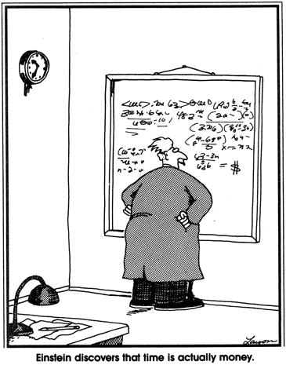

# Production Performance

> Time is Money.

There are always questions around “reasonable expectations” for any given **production** Frog's performance.

These concepts are critical for us as a company whose baseline of performance is **Resources of Human Time** - we don’t bill on how nice we are, how good looking we are, we don't bill on great our ideas are (yet). Ironically, this is not connected to “skill level” - we make a (perhaps incorrect) assumption that all people are of equal skill - or more to the point - that a professional X is capable of doing Y in Z period of time. That’s a pretty reasonable assumption - as you get better and have been working a particular role for X years, you should be able to do it faster, and thus you should be a more senior individual and compensated accordingly for your accomplishments - which means you will be able to do more work in less time.

### Production Performance Rules of Thumb

There are some easy rules of thumb to follow to ensure you are meeting the production levels expected of you at your position at our standard rates.

- If you aren’t **on site 40 hours**, you likely aren’t gonna perform at a reasonable level of expectation. That's why we are sticklers about this.
- If you aren’t billing a **minimum of 28 hours a week (on average)**, you aren't paying for yourself. 32 billable hours is a reasonable expectation of a full-time professional.
- If you aren’t making **$100/hour on average** during these hours, you aren’t paying for yourself. If you go over the allocated hours on your projects due to mis-scoping, you won’t.
- As your salary increases, your hours billed per week should increase as well, through experience and efficiency.
- If you are billing time into administration, or working on projects that don’t have a project listed in Frogweb, you aren’t adding billable time we can track. If it’s not in Frogweb, it doesn’t exist - so you are working on your own time. That’s stupid for everyone involved; don’t do it.
- If you are billing more than an hour a week into a catchall bucket like "Administration" or "Email", you are probably mis-allocating client time or being inefficient.

### Production Constraints

We have a number of constraints on our persons within our control, including (but not only):

1. The number of hours we do of billable work per week - Time we are around, day to day, and working (**Maximum Billable Time**), that doesn't get lost in chaos, inefficiency, and poor time tracking (**Leakage**).
2. The ability to do the work in the Time Sold/Allocated (**Effective Hourly Rate**) - Our personal efficiency and personal skills in getting things quoted correctly and completed on time. (Or the ability to sell a client on your value, not raw throughput).
3. The quality (**Client Success**) of the work (**Client Satisfaction Rate**) - A combination of our skill and focus.
4. How well you Get Along with Others (**Culture Fit**).

Some of these concepts are only applicable to Production Frogs, while others are applicable to all Frogs. What follows are the key concepts applicable only to Production Frogs.

\* Our baseline expectation is that production Frogs work a minimum of 40 hours a week, as stated in our Employee Manual and expressed otherwise. This is higher than “most companies” - but we leave lots of room for other necessary obligations. In actual fact, we don’t care about the hours themselves - we care about “contribution” (which is your billable hours multiplied by your effective hourly rate). But how can we help you improve if you aren’t here and kicking ass?

### Maximum Billable Time

It can be reasonably agreed upon that production team members will have ongoing expectations on them for “non-billable items". These activities will take a minimum of 2-2.5 hours a week and thus reduce the effective contribution of any given individual to 37.5 hours a week (unless you work up to the ESA acceptable standard of 44 hours a week).

Here are reasonable expectations:

* Email checking (15-20 minutes a day, or 1-1.5 hours a week),
* Daily huddles (15 minutes a day, or 1.25 Hours a week),
* Frog-a-versary celebrations (10 minutes X the number of people at Treefrog / 52 weeks / 5 days = 2 minutes a day),
* Pod training (ad-hoc, 1 hour a week),
* Learn o’Clock (1 hour a week),
* State of the Union (2 hours a quarter, or 10 minutes a week)

TOTAL = **2.5 Hours a week** "Unbillable Time".

Side note: although we "require" 40 hours of work a week, we spend at least 2 hours a week on average in "fun" and "learning" which most other companies do not. So in effect, our "higher expectations" are only "higher expectations to be culturally involved at Treefrog and additionally learn from one another".

*Some Pods are more efficient than others with their shared time. What are you doing to reduce the "extra time" you spend and increase your team utilization? Are your Pod Huddles taking hours each day? Help tighten them up to increase your contribution.*

If you look at your billable time in Frogweb, you will find that you have a “quarterly trend” and a “yearly trend”. Quarterly trend is a reasonable assessment of your recent activity (weekly is pretty much useless - anyone can have a crap week, and anything can happen), though yearly trend will remove seasonality (such as Christmas holidays) from this assessment. This should always be above 40.

You can also look at how you spent your time in Frogweb over the last few weeks. How many hours did you bill? How many hours were lost into other random buckets? Why? What have you done to fix this?

### Leakage

#### Perspective for a Production Frog

1. The first few days in a week you work (average = 15 hours) pays for your salary, health and pension.
2. The second few days in a week you work (average = 12 hours) pays for the other person who supports you getting the work, managing the work, and fulfilling the work (Sales, Admin, etc.) - and protecting you from harm so you can work.
3. The first two thirds of the last day in a week you work (average = 5 hours) pays for your nice desk and chair, electricity, computer, roof and air conditioning, etc.
4. The final two hours in the week (think Friday, 2-4pm) is the extra headroom we have to grow into becoming a bigger and better company.

If you don’t bill at least 28-32 hours as a production Frog - you aren’t actually paying your way! You are a burden, not a benefit. In fact - that extra hour you took off early was the one that was there to help pay for Treefrog to do all the extra fun stuff we do. A little time leakage is the difference between a great company and a mediocre company.

If you look at your fellow team members time expenditure in Frogweb, you will find that they fluctuate between 28 and 37 hours on average. Interested in how you fair, and how you are being reviewed? Check the numbers below for the “average Frog”...

##### Example Billable Hourly Performance Levels for an Average Salaried Frog

| Hours          | Performance Level       | This Means                            |
|----------------|-------------------------|---------------------------------------|
| >37.5 hrs/week | Epic (Peak) Performance | “You deserve a bonus."                |
| 34 hrs/week    | Excellent Performance   | “Fantastic! Keep rocking!"            |
| 32 hrs/week    | Good Performance        | “You are doing a great job."          |
| 30 hrs/week    | Acceptable Performance  | “You are doing what is expected."     |
| 28 hrs/week    | Mediocre Performance    | “You are doing the minimum possible." |
| <28 hrs/week   | Poor Performance        | “You are dragging down the team."     |

It doesn’t always add up - you may be working hard, and be showing low hours. If you wonder why you are on site a solid 40 hours a week, feel you are working hard, and you are suffering from being defined as having mediocre or poor performance by this chart - you are possibly billing time into administrative incorrectly or suffering from leakage issues. For example…

- You may be billing all of your client **Email** or **Administration** time against Treefrog when it is actually billable time (which isn’t then billed to the client - meaning we are just throwing away billable time). So yes, mis-allocation reduces your utilization, and thus your effective performance. Work will your Pod Manager to find strategies to reduce this mis-allocation - there are lots of different strategies to alleviate this (e.g. different, more buckets, pre-allocation for core clients, etc.)
- You could be doing a ton of **administrative meetings**, which are actually either a) client-related or a) “internal”. Client related meetings should be billed to clients (Into “sales” if they aren’t yet a sale)... **HAVE QUICKER INTERNAL MEETINGS**, and you’ll be more effective. **EXCUSE YOURSELF** from meetings you aren’t genuinely adding value at. There is time gold in those hills. YES, a more performant Frog either a) works over 40 hours or b) keeps meetings to a bare minimum, with clear agendas and clear goals to complete work quickly.
- You may be new at your job, so you may be spending an inordinate amount of time training and learning. (Under a year at Treefrog you should expect this). Get up to speed! Focus!
- You may have additional “social” activities which you bill to Administration... but it’s really just an excuse for social time. For example, Frog-a-versaries - some people bill 10 mins/wk for this, and others bill 1 hr/week. Who do you think is most effective? If you show up an hour early for a quick event and then hang out for an hour, is this an effective use of your time? No. Maybe you forgot to turn off your time clock? Then fix it - it will only screw you later.
- You may be just genuinely inefficient with your time, or take a lot more breaks or spend time navel-gazing. Work will your Pod members to find strategies to increase your efficiency as a group.

### Reasonable Billing Expectations

Also interesting, when you do some rough calculations on costing based on utilization rate of $100/hour (to be discussed later), you’ll see that at different salary grades, the expectation on your performance increases as your salary increases. Wondering why you aren’t considered a more performant? Check the table...

##### Example Carrying Costs of a Production Frog at $100/hour in “Weekly Hours”

| “Base” Salary | Salary Cost (EI, etc.) | Weekly Hours   for Salary | Carrying Cost (Desk/Computer) | Administration Costs (in Hours) | 10% Growth | **Billed Hours to Cover Self** |
|---------------|------------------------|---------------------------|-------------------------------|---------------------------------|-----------------------|----------------------------|
| $30,000.00    | $42,000.00             | 8.4                       | 5                             | 12                              | 2.3                   | **28**                      |
| $35,000.00    | $49,000.00             | 9.8                       | 5                             | 12                              | 2.4                   | **29**                      |
| $40,000.00    | $56,000.00             | 11.2                      | 5                             | 12                              | 2.5                   | **31**                     |
| $45,000.00    | $63,000.00             | 12.6                      | 5                             | 12                              | 2.7                   | **32**                      |
| $50,000.00    | $70,000.00             | 14                        | 5                             | 12                              | 2.8                   | **34**                      |
| $55,000.00    | $77,000.00             | 15.4                      | 5                             | 12                              | 2.9                   | **35**                      |
| $60,000.00    | $84,000.00             | 16.8                      | 5                             | 12                              | 3.0                   | **37**                      |
| $65,000.00    | $91,000.00             | 18.2                      | 5                             | 12                              | 3.2                   | **38**                       |
| $70,000.00    | $98,000.00             | 19.6                      | 5                             | 12                              | 3.3                   | **40**                      |

If you aren’t at least covering yourself, why would you qualify for a raise? As you get more efficient with your time tracking, reduction of leakage and start billing appropriately for your work, your billable hours should soar.

### Effective Hourly Rate

Another constraint is your “effective hourly rate”. Sure, you might be working 37.5 hours a week, but if every project you work on you spend double your allocated time on (read: what it was sold for), you are also not being effective.

Let’s say, for example, a project sold for $1000, and you worked 10 hours on it. 1000/10 = $100/hour. Ergo, your effective hourly rate on that project is $100. If, however, you were able to do it in 5 hours, your effective hourly rate would have been $200. If you spend 20 hours on it (double!!), your effective hourly rate is $50.

- Our posted rates are $125-150.
- Our “minimum acceptable effective hourly rate” is $100.
- You won’t knock every project out of the park. But you should have a reasonable balance over the last X projects.

So, here’s another table of performance effect, this time by hourly rate:

##### Example Hourly Rate Performance Levels for an Average Salaried Frog (at $125/hour)

| Hours             | Performance Level       | This Means                            |
|-------------------|-------------------------|---------------------------------------|
| >$125/hour        | Epic (Peak) Performance | “You deserve a bonus.”*               |
| $110/hour         | Excellent Performance   | “Fantastic! Keep rocking!"            |
| $105/hour         | Good Performance        | “You are doing a great job."          |
| $100/hour         | Acceptable Performance  | “You are breaking even."              |
| $90/hour          | Mediocre Performance    | “You are doing the minimum possible." |
| <$75/hour         | Poor Performance        | “You are dragging down the team.”     |

\* Careful that external factors (like grant monies!) aren’t skewing your stats - you could be in for a hard days night later.

*Bottom line is, you should be cognizant of what your responsibilities are before starting a project, and ensuring (before you start) that the project is doable within the allocated time. If not, you should go back to sales and re-negotiate*.

\* The balancing factor here is: sales needs to be able to sell it. If you want 1000 hours to pick your nose, clients won’t pay for it, and we’ll run out of work for you to do.

- You may believe sales “undersold” something on you. Or it was “mis-scoped”. So why didn’t your pod get together and work on a better rationale for the sales team that showed what value you were achieving for the client? Sales can’t stop - or you won’t have work to do.
- If you focus on getting the work done, every time, under budget - you’ll almost always have an incredibly high effective hourly rate.

#### Example Effective Contribution of a Production Frog at $50k Salary

| Hourly Rate | 28      | 29      | 30      | 31      | 32      | 33      | 34      | 35      | 36      |
|-------------|---------|---------|---------|---------|---------|---------|---------|---------|---------|
| 50          | *-56,000* | *-53,500* | *-51,000* | *-48,500* | *-46,000* | *-43,500* | *-41,000* | *-38,500* | *-36,000* |
| 75          | *-21,000* | *-17,250* | *-13,500* | *-9,750*  | *-6,000*  | *-2,250*  | 1,500   | 5,250   | 9,000   |
| 90          | *0*       | 4,500   | 9,000   | 13,500  | 18,000  | 22,500  | 27,000  | 31,500  | 36,000  |
| 100         | 14,000  | 19,000  | 24,000  | 29,000  | 34,000  | 39,000  | 44,000  | 49,000  | 54,000  |
| 110         | 28,000  | 33,500  | 39,000  | 44,500  | 50,000  | **55,500**  | **61,000**  | **66,500**  | **72,000**  |
| 125         | 49,000  | **55,250**  | **61,500**  | **67,750**  | **74,000**  | **80,250**  | **86,500**  | **92,750**  | **99,000**  |
| 150         | **84,000**  | **91,500**  | **99,000**  | **106,500** | **114,000** | **121,500** | **129,000** | **136,500** | **144,000** |

From this table, you can see the effect of an individual production Frog's contribution to the company based on two factors: how many hours they work (28-36) and what their average effective hourly rate is ($50-150). This gives you a sense: a production person can underperform and *cost* the company $56,000 a year - or super-perform and generate $144,000, all by themselves!

It's absolutely astonishing to see how significant the effect of one individual's performance can be - it can make or break the company as a whole!

### Contribution

You have to do three things to increase your performance in your production role at Treefrog:

1. You need to be at work **at least 40 hours a week**.
2. You need to **maximize your Billable Hours** - the closer to 40 you get, the better.
3. The projects you work on need to **maintain a high Hourly Rate** - the higher, the better. (You need to do your work in under the quoted time).

Obviously, there are many factors in keeping these things in alignment.

### FAQ

*Why are we always harping about 40 hours a week? Isn’t this overly bureaucratic?*

If you aren’t working 40 hours a week, you can’t hit utilization - unless you skip all training, learning and social activities. The social activities are part of a functional team - so the hourly expectation is there to protect you. By keeping you honest to this, you keep the machine rolling and your performance high.

*Why do we bother tracking Admin time? Why don’t we just bill Production Hours?*

Because it’s possible that all the other things are actually a complete waste of time, and we can’t tell that that is the case until we’ve tracked them for a while and seen that they are. Maybe you actually are doing the work, and didn’t realize it - like not billing internal client meetings. The best way to rationalize this is track everything. Then we can get to the bottom of the problem, together.

*If my Utilization rate is consistently above expected for my salary grade and my Effective Hourly Rate is higher than $100, what am I?*

You are a high-performing, super competent Frog. Let’s talk about improving your compensation.

*What if it’s below?*

Fix it. If your contribution is less than it should be, raises, bonuses and other perks aren’t ever on the table. If it’s too low, you are probably being over-compensated for your role, and that deserves a discussion with your Pod Leader as to how you can catch up with yourself.
